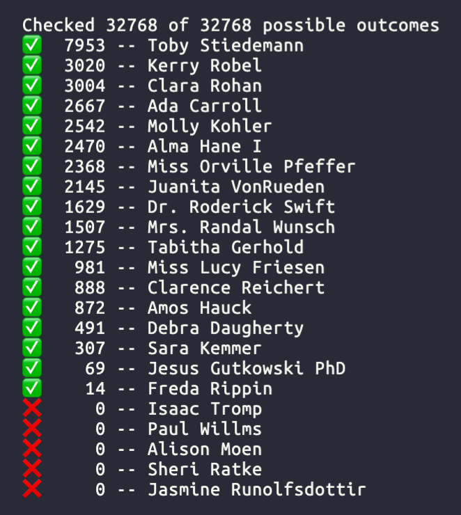
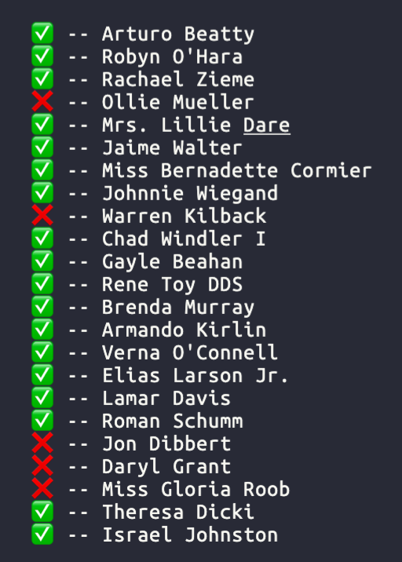

# `ebp`

## Usage

### Get all possible outcomes

This will calculate all remaining outcomes and determine the winner for each (including ties).

```
npx @lukekarrys/ebp@latest $GROUP_ID [--fetch|--calculate]
```



### Get if each entry can win

This is a faster since it stops once each entry has at least one possible winning outcome.

```
npx @lukekarrys/ebp@latest $GROUP_ID can-win [--fetch|--calculate]
```



**options**

Results and entries will be cached in `${PWD}/ebp-${GROUP_ID}/`.

- `--fetch`: this will force a refetch of the live data
- `--calculate`: this will recalculate the results

This project is not affiliated with ESPN in any way.
